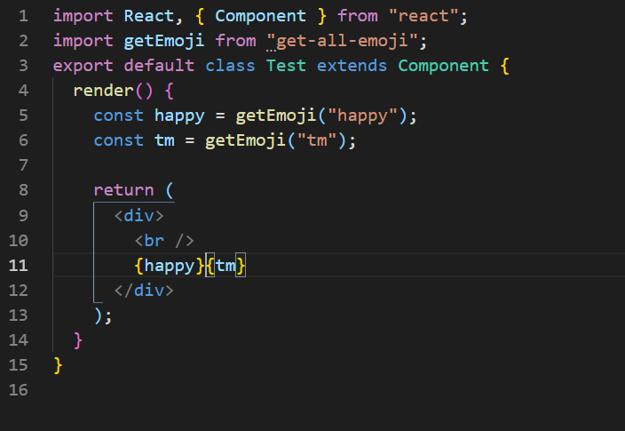

[](https://badge.fury.io/js/node)

## Installation

This is a [Node.js](https://nodejs.org/en/) module available through the
[npm registry](https://www.npmjs.com/).

Before installing just [download and install Node.js](https://nodejs.org/en/download/).
Node.js 0.10 or higher is required.

Run `npm i -S get-all-emoji`

### Example

```javascript
const getEmoji = require("get-all-emoji");
console.log(getEmoji("happy"));

or you can also use;

var q = getEmoji("family_one_girl");
```

## Documentation

Simply take the name of any emoji from more than **1800** emojis present, and pass it as a parametere as shown in above example.

You'll find the _name of emoji_ from the links present below, which are encoded, and you can replace it instead of happy in above diagram.

## keywords encoded

1. [w3-emojis](https://www.w3schools.com/charsets/ref_emoji_smileys.asp)
2. [special-emojis](https://github.com/Anant016/npm-get-all-emoji/blob/master/list.js)

## Support

If you want to support, please consider donating. It'll help me in development and making more cool packages for you:

[](https://paypal.me/ARungta)

## Work with react

### Code



### Output


